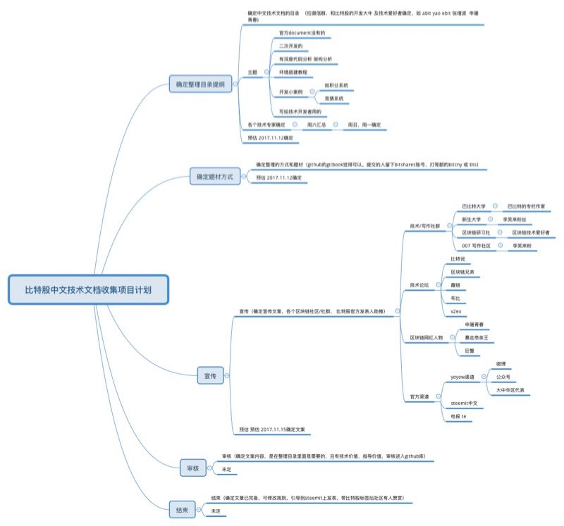

# bts-cn-docs
比特股 BitShares (BTS) 中文技术文档

建这个库的目的是搜集和整理比特股 BitShare (BTS) 相关的中文技术文档，方便开发者和爱好者使用，以及共同维护。

# 规划
我规划的路径是
### 》1 确定中文技术文档的目录  （拉微信群，和比特股的开发大牛爱好者确定，如 yao ebit 张增波 常川 facjas）
目录更新后上传到https://github.com/abitmore/bts-cn-docs

### 》2 确定整理的方式和题材（github的gitbook觉得可以。提交的人留下bitshares账号，打等额的bitcny 或 bts） 
### 》3 宣传（确定宣传文案，各个区块链社区/社群， 比特股官方发表人助推）
### 》4 审核（确定在技术文案的内容，是在整理目录里面的，且有技术价值、指导价值，审核进入github库）
### 》5 结束（确定文章已完备，可修改规则，引导到steemit上发表，带比特股标签后社区有人赞赏）

## 备注：
### 1 旧的已发表文章收录，直接联系上，打800
### 2 新的要求markdown提交到github，留下账号，并转账（memo留下文章名）
### 3 github上宣传投票给中华区代理work

# 目录初稿

## 目录/索引

* 如何编译
  * [使用 Visual Studio 2015 编译 BitShares-Core](https://github.com/abitmore/bts-cn-docs/blob/master/%E4%BD%BF%E7%94%A8VisualStudio2015%E7%BC%96%E8%AF%91BitShares-Core.txt)

* 如何集成/对接
  * [BTS交易所对接指南](https://github.com/abitmore/bts-cn-docs/blob/master/BTS%E4%BA%A4%E6%98%93%E6%89%80%E5%AF%B9%E6%8E%A5%E6%8C%87%E5%8D%97.txt)

## 相关资料

### 英文资料
* https://github.com/bitshares/bitshares-core/wiki
* https://docs.bitshares.org/

### 中文资料
（以下排名不分先后）
* boombastic 的 Steemit 博客 https://steemit.com/@boombastic
  * [BitShares API 服务器架设指南 - 个人篇](https://steemit.com/bitshares/@boombastic/bitshares-api)
  * [BitShares API 服务器架设指南 - 公共API篇](https://steemit.com/bitshares/@boombastic/bitshares-api-api)
* legendx 的 Steemit 博客 https://steemit.com/@legendx
  * [DPOS共识算法 -- 缺失的白皮书](https://steemit.com/dpos/@legendx/dpos)
* 小福星(Pluswave)的博客 https://blog.xiaofuxing.name/
  * [比特股钱包模式和账号模式的安全性差异](https://blog.xiaofuxing.name/2017/07/06/security_difference_between_wallet_mode_and_account_mode_of_bitshares_ui.html)
  * [bitsharesjs库详解二：交易广播](https://blog.xiaofuxing.name/2017/06/08/bitsharesjs_detail_transaction_broadcast.html)
  * [比特股命令行神器:uptick (注：python)](https://blog.xiaofuxing.name/2017/06/01/uptick.html)
  * [bitsharesjs库详解一：ChainStore](https://blog.xiaofuxing.name/2017/05/25/bitsharesjs_detail_chainstore.html)
  * [源码解析：bitshares-ui的钱包和帐号管理](https://blog.xiaofuxing.name/2017/05/17/bitshares_ui_wallet_and_account_management.html)
  * [使用NODEJS解密bitshares网页钱包备份文件](https://blog.xiaofuxing.name/2017/05/03/decrypt_bitshares_web_wallet_with_nodejs.html)
  * [身份认证概念原型发布，目前的反馈和我的思考](https://blog.xiaofuxing.name/2017/04/26/login_with_any_cryptocurrency_prototype_released.html)
* 剑有偏锋的比特股开发专题博客 http://www.jianshu.com/c/19c5791c8c7d
  * [比特股环境搭建](http://www.jianshu.com/p/b54782cd1926)
  * [编译比特股网页钱包](http://www.jianshu.com/p/5be0344e30cd)
  * [比特股全节点witness_node参数翻译](http://www.jianshu.com/p/9a58ad875cc3)
  * [比特股命令行钱包cli_wallet参数翻译](http://www.jianshu.com/p/d0698e4a9b13)
  * [搭建比特股的水龙头注册服务](http://www.jianshu.com/p/a89b3835d4e8)
  * [比特股相关资源链接](http://www.jianshu.com/p/95657f2463f1)
* 比特帝国教程 http://jc.btsabc.org/
  * [自建节点（重钱包）](http://btsabc.org/article-477-1.html)
  * [BTSBots——比特股内盘做市机器人开放使用教程(Javascript)](http://btsabc.org/article-861-1.html)
  * [BTS内盘自动交易机器人的例子和源码(Python)](http://btsabc.org/article-721-1.html)
  * [比特股合规设计功能 ---“白名单”使用教程](http://btsabc.org/article-784-1.html)
  * [二元预测市场举例](http://btsabc.org/article-610-1.html)
  * [一单将资产的“手续费资金”全部刷出](http://btsabc.org/article-612-1.html)
  * [在windows环境下实现BTS2.0自动分红的一种方法](http://btsabc.org/article-716-1.html)
* 比特股论坛中文版 https://bitsharestalk.org/index.php/board,4.0.html
  * [见证人(witness)安装设置教程](https://bitsharestalk.org/index.php?topic=18929.0)
* Hi区块链资讯站及公众号 https://www.hibtc.org/
  * [一分钟安装完比特股重钱包，可以媲美中心化交易所一样的交易速度](https://mp.weixin.qq.com/s?__biz=MzAxNTIwNTEwMQ==&mid=2650185196&idx=1&sn=fc1650060dec749461ce282f9854d6ef&scene=19#wechat_redirect)
* 本库中 @abitmore 的部分原创文档也同步发到 Steemit 博客 https://steemit.com/@abit
