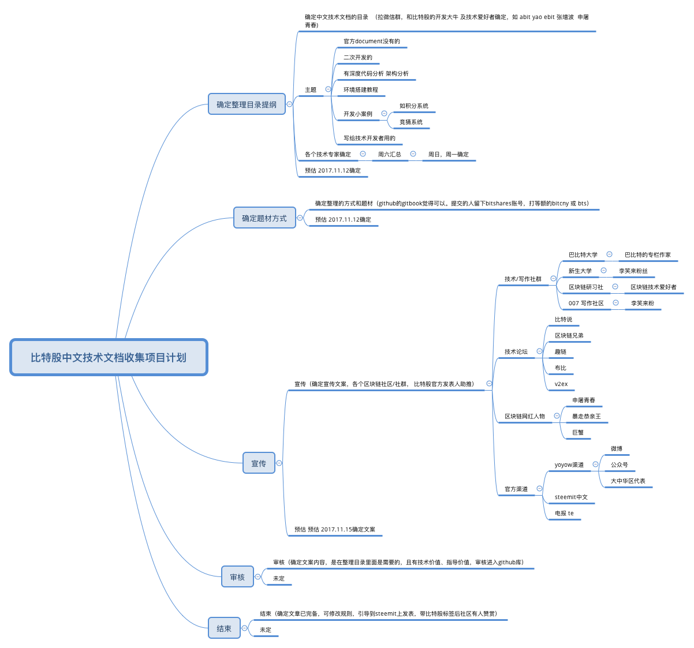
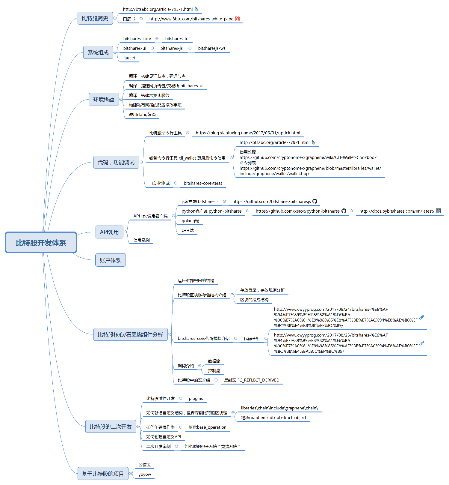

# bts-cn-docs
比特股 BitShares (BTS) 中文技术文档

建这个库的目的是搜集和整理比特股 BitShare (BTS) 相关的中文技术文档，方便开发者和爱好者使用，以及共同维护。
收录给作者800一篇的直接奖励（等值的bitcny）

# 规划
我规划的路径是
### 》1 确定中文技术文档的目录  （拉微信群，和比特股的开发大牛爱好者确定，如 yao ebit 张增波 常川 facjas）目录更新后上传到https://github.com/abitmore/bts-cn-docs
### 》2 确定整理的方式和题材（github的gitbook觉得可以。提交的人留下bitshares账号，打等额的bitcny 或 bts） 
### 》3 宣传（确定宣传文案，各个区块链社区/社群， 比特股官方发表人助推）
### 》4 审核（确定在技术文案的内容，是在整理目录里面的，且有技术价值、指导价值，审核进入github库）
### 》5 结束（确定文章已完备，可修改规则，引导到steemit上发表，带比特股标签后社区有人赞赏）

## 备注：
### 1 旧的已发表文章收录，直接联系上，打800
### 2 新的要求markdown提交到github，留下账号，并转账（memo留下文章名）
### 3 github上宣传投票给中华区代理work

# 目录初稿

# <a name="6bqtgv1kglo5kjpqkrthn6pj53">比特股开发体系</a>
## <a name="3b8dcsftbm7c0sj1s2ml544af1">比特股简史</a>
### <a name="4257kejo046aq23uiu4nku4723"> http://btsabc.org/article-793-1.html</a>
### <a name="6kvgpl2fta8djar0egkibbps8p"> 白皮书</a>
### <a name="2rnvim9q12ain2oc7s712s7rrq">  http://www.8btc.com/bitshares-white-pape</a>
## <a name="2qn1nd6p3qqfcumnio7qp7o855">系统组成</a>
### <a name="5iuucgbbje433j5l7spn52k1a5"> bitshares-core</a>
### <a name="3j79h6ielrcvv02j6bi55bh6ii">  bitshares-fc</a>
### <a name="5l0hktue4gvrqvolub22j4n79c"> bitshares-ui</a>
### <a name="590jiis6dqap5a7iifoclq9dtm">  bitshares-js</a>
### <a name="7a2alo4khthsrca89bsljqaq5c">   bitsharesjs-ws</a>
### <a name="0ochb2gnrahggjd94r2r4b8au2"> faucet</a>
## <a name="57nv4nq2lelosbu9nfe61cq5h8">环境搭建</a>
### <a name="7kpu6a5r51tvq5bb390ur6tqq6"> 编译，搭建见证节点，延迟节点</a>
### <a name="4prsiuud11k7moslfpc78cfha0"> 编译，搭建网页钱包/交易所 bitshares-ui</a>
### <a name="01j30sb9j5g9ml0kvl60ocepsr"> 编译，搭建水龙头服务</a>
### <a name="1uilvjlpjgjc3snk6cpg6evkp9"> 构建私有网络的配置修改事项</a>
### <a name="44btora4c8ppr8ehddv5eetfcl"> 使用clang编译</a>
## <a name="0psf9pvti5hucqg236i69h9hkn">代码，功能调试</a>
### <a name="3amvdd3vdm34qo5u9sv1b6rlgh"> 比特股命令行工具</a>
### <a name="5avlu5mimben59arakl7hott9q">  https://blog.xiaofuxing.name/2017/06/01/uptick.html</a>
### <a name="66gsckf5o1mrer8i831ipk9dl9"> 钱包命令行工具 cli_wallet 登录后命令使用</a>
### <a name="1lv17r74fist8o0luj292m1h2v">  http://btsabc.org/article-779-1.html</a>
### <a name="2cn73oh5one5lddvi5bu5eedai">  使用教程 https://github.com/cryptonomex/graphene/wiki/CLI-Wallet-Cookbook 命令列表 https://github.com/cryptonomex/graphene/blob/master/libraries/wallet/include/graphene/wallet/wallet.hpp</a>
### <a name="6gimff1glplaaoj8l6dq1kalgc"> 自动化测试</a>
### <a name="6dor7k29adjunl352p7sk62obu">  bitshares-core\tests</a>
## <a name="55haeuulds5c0g5l4hu65rt7gg">API调用</a>
### <a name="3bj4ad2ar8tfh003i7tougtar7"> API rpc调用客户端</a>
### <a name="3h19hb7i6vfkqf3378droctg6q">  js客户端 bitsharesjs</a>
### <a name="0vfskj7mck46ib84n13peubdi6">   https://github.com/bitshares/bitsharesjs</a>
### <a name="06ku90q6oghto95j6af1k4stl2">  python客户端 python-bitshares</a>
### <a name="1ke6h8a8bamg1r7ljhce0ku5n2">   https://github.com/xeroc/python-bitshares</a>
### <a name="69frirsl0cl6kd60ln256cjo2e">    http://docs.pybitshares.com/en/latest/</a>
### <a name="6alar80evu5kf3blibre1p0tja">  golang端</a>
### <a name="1knf2jtva2hv8tfsireodv2pe4">  c++端</a>
### <a name="2khsnm28obvvbucnu7tairu0qa"> 使用案例</a>
## <a name="2lbut0j8dupfv78pekn7rpoucq">账户体系</a>
## <a name="0qs7ek25h3bq0mfrrmu05l00m3">比特股核心/石墨烯组件分析</a>
### <a name="2ecpkeukh2vmfb9atm94j5ktsj"> 运行时部署网络结构</a>
### <a name="5o8s7t26fl52ncqlssn4u2jofn"> 比特股区块链存储结构介绍</a>
### <a name="6j6555k9lm6uo5hsd1ua98prci">  存放目录，存放规则分析</a>
### <a name="4t4qva6sl1v5ci1fh8tuikuhht">  区块的组成结构</a>
### <a name="5f91rf9dc3pcal0npjl551vv1o"> bitshares-core代码模块介绍</a>
### <a name="4dodqiab8usa2dsouhqcb1rm34">  代码分析</a>
### <a name="1vck7lt7c2058k83kd5rvs9a5r">   http://www.cwyyprog.com/2017/08/24/bitshares-%E6%AF%94%E7%89%B9%E8%82%A1%E6%BA%90%E7%A0%81%E9%98%85%E8%AF%BB%E7%AC%94%E8%AE%B0%EF%BC%88%E4%B8%80%EF%BC%89/</a>
### <a name="10nki4j65bfv8nag83ed10jh85">   http://www.cwyyprog.com/2017/08/25/bitshares-%E6%AF%94%E7%89%B9%E8%82%A1%E6%BA%90%E7%A0%81%E9%98%85%E8%AF%BB%E7%AC%94%E8%AE%B0%EF%BC%88%E4%BA%8C%EF%BC%89/</a>
### <a name="7lqcru7vmkk6v0tieoka4cgigh"> 架构介绍</a>
### <a name="20q5bqphqob18sos5vpt204j56">  数据流</a>
### <a name="6m46h41vojakhjt7rg7df6qs01">  控制流</a>
### <a name="5fuebd64comicbmptan4albhof"> 比特股中的宏介绍</a>
### <a name="7t38couhtc6b0pahsnjkge1npr">  反射宏 FC_REFLECT_DERIVED</a>
## <a name="3vmjf87473cpjos0molkbidv04">比特股的二次开发</a>
### <a name="0m36clv12a1pkokknaq48rf597"> 比特股插件开发</a>
### <a name="4oupng59bh6eo8cngui26njc08">  plugins</a>
### <a name="73k7aelq2nartcgb7obuag5otl"> 如何新增自定义结构，且保存到比特股区块链</a>
### <a name="1lupnj2svpp665h17p30gcpif0">  libraries\chain\include\graphene\chain\</a>
### <a name="5rakvfh9k6im6atsd3siruq318">  继承graphene::db::abstract_object</a>
### <a name="37js91ans7gesapoi9hde3mtg8"> 如何创建操作类</a>
### <a name="065rpciujet46ss3a1c6jes3r0">  继承base_operation</a>
### <a name="4h6h4kl5j1aq09v63nkgo3s8ii"> 如何创建自定义API</a>
### <a name="621cceo7hp01t6tccgigq8eq07"> 二次开发案例</a>
### <a name="7a8gnlr1vsm6p43464o1peqf4g">  如小型的积分系统？竞猜系统？</a>
## <a name="01iqcjvliudvmgk4obt9b9a0sh">基于比特股的项目</a>
### <a name="7uuanrkpfv6jv1gqenrhcto31q"> 公信宝</a>
### <a name="39d12vjpbien0t108utuj37e6t"> yoyow</a>

# 历史记录分割线
## 目录/索引

* 如何编译
  * [使用 Visual Studio 2015 编译 BitShares-Core](https://github.com/abitmore/bts-cn-docs/blob/master/%E4%BD%BF%E7%94%A8VisualStudio2015%E7%BC%96%E8%AF%91BitShares-Core.txt)

* 如何集成/对接
  * [BTS交易所对接指南（单节点版）](https://github.com/abitmore/bts-cn-docs/blob/master/BTS%E4%BA%A4%E6%98%93%E6%89%80%E5%AF%B9%E6%8E%A5%E6%8C%87%E5%8D%97%EF%BC%88%E5%8D%95%E8%8A%82%E7%82%B9%E7%89%88%EF%BC%89.txt)

## 相关资料

### 英文资料
* https://github.com/bitshares/bitshares-core/wiki
* https://docs.bitshares.org/
* https://bitshares.org/doxygen/hierarchy.html 这个是从代码生成出来的文档，包含代码里的文档性注释。
* https://bitsharestalk.org/index.php?topic=23925.0 搭节点
* https://steemit.com/bitshares/@ihashfury/distributed-access-to-the-bitshares-decentralised-exchange 搭网页钱包

### 中文资料
（以下排名不分先后）
* boombastic 的 Steemit 博客 https://steemit.com/@boombastic
  * [BitShares API 服务器架设指南 - 个人篇](https://steemit.com/bitshares/@boombastic/bitshares-api)
  * [BitShares API 服务器架设指南 - 公共API篇](https://steemit.com/bitshares/@boombastic/bitshares-api-api)
* legendx 的 Steemit 博客 https://steemit.com/@legendx
  * [DPOS共识算法 -- 缺失的白皮书](https://steemit.com/dpos/@legendx/dpos)
* 小福星(Pluswave)的博客 https://blog.xiaofuxing.name/
  * [比特股钱包模式和账号模式的安全性差异](https://blog.xiaofuxing.name/2017/07/06/security_difference_between_wallet_mode_and_account_mode_of_bitshares_ui.html)
  * [bitsharesjs库详解二：交易广播](https://blog.xiaofuxing.name/2017/06/08/bitsharesjs_detail_transaction_broadcast.html)
  * [比特股命令行神器:uptick (注：python)](https://blog.xiaofuxing.name/2017/06/01/uptick.html)
  * [bitsharesjs库详解一：ChainStore](https://blog.xiaofuxing.name/2017/05/25/bitsharesjs_detail_chainstore.html)
  * [源码解析：bitshares-ui的钱包和帐号管理](https://blog.xiaofuxing.name/2017/05/17/bitshares_ui_wallet_and_account_management.html)
  * [使用NODEJS解密bitshares网页钱包备份文件](https://blog.xiaofuxing.name/2017/05/03/decrypt_bitshares_web_wallet_with_nodejs.html)
  * [身份认证概念原型发布，目前的反馈和我的思考](https://blog.xiaofuxing.name/2017/04/26/login_with_any_cryptocurrency_prototype_released.html)
* 剑有偏锋的比特股开发专题博客 http://www.jianshu.com/c/19c5791c8c7d
  * [比特股环境搭建](http://www.jianshu.com/p/b54782cd1926)
  * [编译比特股网页钱包](http://www.jianshu.com/p/5be0344e30cd)
  * [比特股全节点witness_node参数翻译](http://www.jianshu.com/p/9a58ad875cc3)
  * [比特股命令行钱包cli_wallet参数翻译](http://www.jianshu.com/p/d0698e4a9b13)
  * [搭建比特股的水龙头注册服务](http://www.jianshu.com/p/a89b3835d4e8)
  * [比特股相关资源链接](http://www.jianshu.com/p/95657f2463f1)
* 比特帝国教程 http://jc.btsabc.org/
  * [自建节点（重钱包）](http://btsabc.org/article-477-1.html)
  * [BTSBots——比特股内盘做市机器人开放使用教程(Javascript)](http://btsabc.org/article-861-1.html)
  * [BTS内盘自动交易机器人的例子和源码(Python)](http://btsabc.org/article-721-1.html)
  * [比特股合规设计功能 ---“白名单”使用教程](http://btsabc.org/article-784-1.html)
  * [二元预测市场举例](http://btsabc.org/article-610-1.html)
  * [一单将资产的“手续费资金”全部刷出](http://btsabc.org/article-612-1.html)
  * [在windows环境下实现BTS2.0自动分红的一种方法](http://btsabc.org/article-716-1.html)
* 比特股论坛中文版 https://bitsharestalk.org/index.php/board,4.0.html
  * [见证人(witness)安装设置教程](https://bitsharestalk.org/index.php?topic=18929.0)
* Hi区块链资讯站及公众号 https://www.hibtc.org/
  * [一分钟安装完比特股重钱包，可以媲美中心化交易所一样的交易速度](https://mp.weixin.qq.com/s?__biz=MzAxNTIwNTEwMQ==&mid=2650185196&idx=1&sn=fc1650060dec749461ce282f9854d6ef&scene=19#wechat_redirect)
* 邱绍锡的博客 https://qiushaoxi.com/
  * [Bitshares 私链部署witness节点](https://www.jianshu.com/p/2cb1cdb98529) / [原文](https://qiushaoxi.com/2017/12/20/bitshares-witness/)
  * [使用 NodeJS 调用 API 接口 进行转账和 Bitshares 内盘交易](https://www.jianshu.com/p/70dcfe9b76b5) / [原文](https://qiushaoxi.com/2018/01/25/bitsharesjs-sample/)
* BTS500的博客 https://bts500.github.io/categories/Bitshares/
  * [Bitshares 开发者系列（1）—— Api接口的访问方式](https://bts500.github.io/2018/03/01/Bitshares%20%E5%BC%80%E5%8F%91%E8%80%85%E7%B3%BB%E5%88%97%EF%BC%881%EF%BC%89%E2%80%94%E2%80%94%20Api%E6%8E%A5%E5%8F%A3%E7%9A%84%E8%AE%BF%E9%97%AE%E6%96%B9%E5%BC%8F/)
  * [Bitshares 开发者系列（2）—— Bitsharesjs-ws 库源码解读](https://bts500.github.io/2018/03/12/Bitshares-%E5%BC%80%E5%8F%91%E8%80%85%E7%B3%BB%E5%88%97%EF%BC%882%EF%BC%89%E2%80%94%E2%80%94-Bitsharesjs-ws-%E5%BA%93%E6%BA%90%E7%A0%81%E8%A7%A3%E8%AF%BB/)
* 本库中 @abitmore 的部分原创文档也同步发到 Steemit 博客 https://steemit.com/@abit
